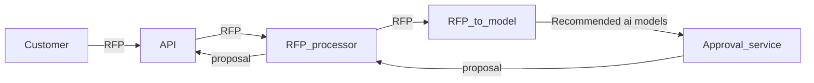

# Problem statement 
Automating RFP processing and dispatching proposals to customers through generative ai

## Service architecture

```mermaid  
graph LR
    Customer -->|RFP| API
    API -->|RFP| RFP_processor
    RFP_processor -->|RFP| RFP_to_model
    RFP_to_model --> |Recommended ai models|Approval_service
    Approval_service -->|proposal| RFP_processor
    RFP_processor --> |proposal| API
```
